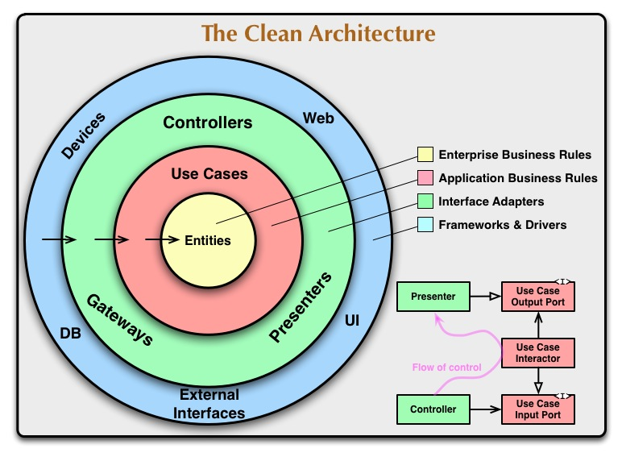
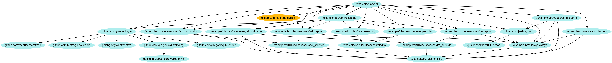
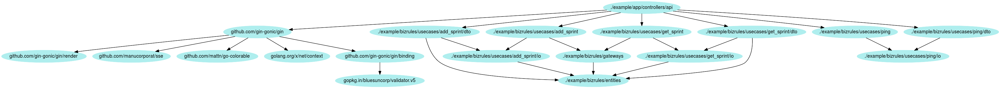
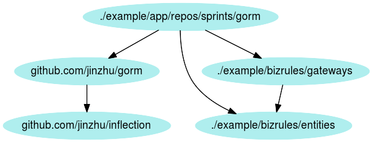
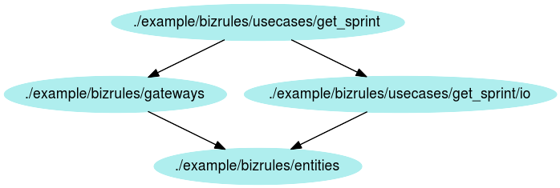

# [fit] "Clean" Architecture

## Veni, Vedi, P.O.C.

### 2016, by Manfred Touron (@moul)

---

# design slogans 1/2 [^1]

* YAGNI (You Ain't Gonna Need It)
* KISS (Keep It Simple, Stupid)
* DRY (Don't Repeat Yourself)
* S.O.L.I.D (SRP, OCP, LS, IS, DI)
* TDD (Test Driven Development)

---

# design slogans 2/2 [^1]

* BDD (Behavior Driven Development)
* DDD (Domain Driven Design
* ...

---

# design types [^1]

* MVC
* N3 Architectures
* Domain Driven Design
* Clean Architecture

---



---


# the "clean" architecture [^2]


---

# `./cmd/api`



```go
func main() {
	// Setup gateways
	var sprintsGw gateways.Sprints
	if len(os.Args) > 1 && os.Args[1] == "--mem" {
		// configure a memory-based sprints gateway
		sprintsGw = sprintsmem.New()
	} else {
		// configure a sqlite-based sprints gateway
		db, err := gorm.Open("sqlite3", "test.db")
		if err != nil {
			panic(err)
		}
		defer db.Close()
		sprintsGw = sprintsgorm.New(db)
	}

	// Setup usecases
	getSprint := getsprint.New(sprintsGw, getsprintdto.ResponseAssembler{})
	addSprint := addsprint.New(sprintsGw, addsprintdto.ResponseAssembler{})
	ping := ping.New(pingdto.ResponseAssembler{})
	//closeSprint := closesprint.New(sprintsGw, closesprintdto.ResponseBuilder{})

	// Setup API
	gin := gin.Default()
	gin.GET("/sprints/:sprint-id", apicontrollers.NewGetSprint(&getSprint).Execute)
	gin.POST("/sprints", apicontrollers.NewAddSprint(&addSprint).Execute)
	gin.GET("/ping", apicontrollers.NewPing(&ping).Execute)
	//gin.DELETE("/sprints/:sprint-id", apicontrollers.NewCloseSprint(&closeSprint).Execute)

	// Start
	gin.Run()
    }
```

---

# `./app/controllers/api`



```go
type GetSprint struct {
	uc *getsprint.UseCase
}

func (ctrl *GetSprint) Execute(ctx *gin.Context) {
	sprintID, err := strconv.Atoi(ctx.Param("sprint-id"))
	if err != nil {
		ctx.JSON(http.StatusNotFound, gin.H{"error": "Invalid 'sprint-id'"})
		return
	}

	req := getsprintdto.RequestBuilder{}.
		Create().
		WithSprintID(sprintID).
		Build()

	resp, err := ctrl.uc.Execute(req)
	if err != nil {
		ctx.JSON(http.StatusInternalServerError, gin.H{"error": fmt.Sprintf("%v", err)})
		return
	}

	ctx.JSON(http.StatusOK, gin.H{"result": GetSprintResponse{
		CreatedAt:         resp.GetCreatedAt(),
		EffectiveClosedAt: resp.GetEffectiveClosedAt(),
		ExpectedClosedAt:  resp.GetExpectedClosedAt(),
		Status:            resp.GetStatus(),
	}})
}

type GetSprintResponse struct {
	CreatedAt         time.Time `json:"created-at"`
	EffectiveClosedAt time.Time `json:"effective-closed-at"`
	ExpectedClosedAt  time.Time `json:"expected-closed-at"`
	Status            string    `json:"status"`
}
```

---

### `./app/repos/sprints/gorm`



```go
type Repo struct { // implements gateways.Sprints
	db *gorm.DB
}

func (r Repo) Find(id int) (*entities.Sprint, error) {
	obj := sprintModel{}
	if err := r.db.First(&obj, "id = ?", id).Error; err != nil {
		return nil, err
	}

	ret := entities.NewSprint()
	ret.SetCreatedAt(obj.CreatedAt)
	ret.SetID(int(obj.ID))
	ret.SetStatus(obj.status)
	ret.SetEffectiveClosedAt(obj.effectiveClosedAt)
	ret.SetExpectedClosedAt(obj.expectedClosedAt)

	return ret, nil
}
```

---

### `./bizrules/usecases/get_sprint`



```go
type UseCase struct {
	gw   gateways.Sprints
	resp getsprintio.ResponseAssembler
}

func (uc *UseCase) Execute(req Request) (Response, error) {
	sprint, err := uc.gw.Find(req.GetID())
	if err != nil {
		return nil, err
	}

	return uc.resp.Write(sprint)
}
```

---

# pros

* ...
* ...
* ...

---

# cons

* ...
* ...
* ...

---

# conclusion

* ...
* ...
* ...

---

# questions ?

### github.com/moul/cleanarch
### @moul

[^1]: more info: http://fr.slideshare.net/RomainKuzniak/design-applicatif-avec-symfony2
[^2]: https://8thlight.com/blog/uncle-bob/2012/08/13/the-clean-architecture.html
